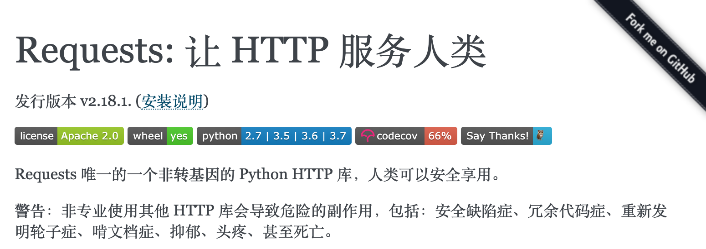

## 好玩的 Python

因为下面的代码都非常简单，简单到直接使用 Python 的交互式环境就能完成。当然，官方 Python 自带的交互式环境比较难用，推荐大家使用 ipython，可使用下面的命令来安装 ipython，安装成功后键入 ipython 命令就能进入交互式环境。

```Shell
pip install ipython
```

或

```Shell
pip3 install ipython
```

ipython 最直观的优点：

1. 可用?或??来获取帮助。
2. 可用!调用系统命令。
3. 可使用 Tab 键自动补全。
4. 可使用魔法指令，如：%timeit。

### 没有工具用代码也能 P 图

1. 安装 pillow 三方库。

   PIL（Python Imaging Library）是 Python 平台事实上的图像处理标准库了。PIL 功能非常强大，而 API 却非常简单易用。但是 PIL 仅支持到 Python 2.7，而且很多年都没有人维护了，于是一群志愿者在 PIL 的基础上创建了兼容的版本，名字叫[Pillow](https://github.com/python-pillow/Pillow)，除了支持 Python 3.x 还加入了很多有用且有趣的新特性。

   ```Shell
   pip install pillow
   ```

   或

   ```Shell
   pip3 install pillow
   ```

2. 加载图片。

   ```py
   from PIL import Image

   chiling = Image.open('chiling.jpg')
   chiling.show()
   ```

3. 使用滤镜。

   ```Shell
   from PIL import ImageFilter

   chiling.filter(ImageFilter.EMBOSS).show()
   chiling.filter(ImageFilter.CONTOUR).show()
   ```

4. 图像剪裁和粘贴。

   ```py
   rect = 220, 690, 265, 740
   watch = chiling.crop(rect)
   watch.show()
   blured_watch = watch.filter(ImageFilter.GaussianBlur(4))
   chiling.paste(blured_watch, (220, 690))
   chiling.show()
   ```

5. 生成镜像。

   ```py
   chiling2 = chiling.transpose(Image.FLIP_LEFT_RIGHT)
   chiling2.show()
   ```

6. 生成缩略图。

   ```py
   width, height = chiling.size
   width, height = int(width * 0.4), int(height * 0.4)
   chiling.thumbnail((width, height))
   ```

7. 合成图片。

   ```py
   frame = Image.open('frame.jpg')
   frame.show()
   frame.paste(chiling, (210, 150))
   frame.paste(chiling2, (522, 150))
   frame.show()
   ```

上面的知识在[Python-100-Days](https://github.com/jackfrued/Python-100-Days)项目的[第 15 天](https://github.com/jackfrued/Python-100-Days/blob/master/Day01-15/15.%E5%9B%BE%E5%83%8F%E5%92%8C%E5%8A%9E%E5%85%AC%E6%96%87%E6%A1%A3%E5%A4%84%E7%90%86.md)中也有对应的内容。

### 向微信好友群发祝福视频

1. 安装 itchat 三方库。

   [itchat](https://itchat.readthedocs.io/zh/latest/)是一个开源的微信个人号接口，使用 Python 调用微信从未如此简单。

   ```Shell
   pip install itchat
   ```

   或

   ```Shell
   pip3 install itchat
   ```

2. 登录微信。

   ```py
   import itchat

   itchat.auto_login()
   ```

   > 用自己的微信扫描屏幕上出现的二维码就完成了登录操作，登录之后才能获取自己的好友信息以及发送消息给自己的好友。

3. 查找自己的朋友。

   ```py
   friends_list = itchat.get_friends(update=True)
   print(len(friends_list))
   luohao = friends_list[0]
   props = ['NickName', 'Signature', 'Sex']
   for prop in props:
       print(luohao[prop])
   ```

   > friends_list 相当于是一个列表，列表中的第一个元素是自己。

4. 随机选出 5 个朋友，获得他们的用户名、昵称、签名。

   ```py
   lucky_friends = random.sample(friends_list[1:], 5)
   props = ['NickName', 'Signature', 'City']
   for friend in lucky_friends:
       for prop in props:
           print(friend[prop] or '没有此项信息')
       print('-' * 80)
   ```

5. 给朋友发送文字消息。

   ```py
   itchat.send_msg('急需一个红包来拯救堕落的灵魂！！！', toUserName='@8e06606db03f0e28d0ff884083f727e6')
   ```

6. 群发视频给幸运的朋友们。

   ```py
   lucky_friends = random.sample(friends_list[1:], 5)
   for friend in lucky_friends:
       username = friend['UserName']
       itchat.send_video('/Users/Hao/Desktop/my_test_video.mp4', toUserName=username)
   ```

利用 itchat 还能做很多事情，比如有好友给自己发了消息又撤回了，如果想查看这些被撤回的消息，itchat 就可做到（注册一个接收消息的钩子函数，请参考[CSDN 上的一篇文章](https://blog.csdn.net/enweitech/article/details/79585043)）；再比如，有时想知道某个好友有没有把删除或拉入黑名单，也可利用 itchat 封装的群聊功能，非好友和黑名单用户不会被拉入群聊，通过创建群聊函数的返回值就可判定你和指定的人之间的关系。

### 不用客户端查看热点新闻

1. 安装 requests 库。（点击常看[官方文档](https://2.python-requests.org/zh_CN/latest/)）

   

   ```Shell
   pip install requests
   ```

   或

   ```Shell
   pip3 install requests
   ```

2. 爬取新闻数据或通过 API 接口获取新闻数据。

   ```py
   import requests

   resp = requests.get('http://api.tianapi.com/allnews/?key=请使用自己申请的Key&col=7&num=50')
   ```

   > 上面使用了天行数据提供的数据接口，需要的话可自行去[天行数据](https://www.tianapi.com/)的网站注册开通，调用接口的时要填写注册成功后系统分配给你的 key。

3. 使用反序列化将 JSON 字符串解析为字典并获取新闻列表。

   ```py
   import json

   newslist = json.loads(resp.text)['newslist']
   ```

4. 对新闻列表进行循环遍历，找到感兴趣的新闻，例如：华为。

   ```py
   for news in newslist:
       title = news['title']
       url = news['url']
       if '华为' in title:
           print(title)
           print(url)
   ```

5. 调用短信网关发送短信到手机上，告知关注的新闻标题并给出链接。

   ```py
   import re

   pattern = re.compile(r'https*:\/\/[^\/]*\/(?P<url>.*)')
   matcher = pattern.match(url)

   if matcher:
       url = matcher.group('url')
       resp = requests.post(
           url='http://sms-api.luosimao.com/v1/send.json',
           auth=('api', 'key-请使用你自己申请的Key'),
           data={
               'mobile': '13548041193',
               'message': f'发现一条您可能感兴趣的新闻 - {title}，详情点击https://news.china.com/{url} 查看。【Python小课】'
           },
           timeout=10,
           verify=False
       )
   ```

   > 上面的代码使用了[螺丝帽](https://luosimao.com/)提供的短信网关服务，利用短信网关发送短信是需要支付费用的，但是一般的平台都会提供若干条免费的测试短信。发送短信必须遵守平台的规则，违规的短信是无法发送的。上面发短信时使用的短信模板（“发现一条您可能感兴趣的新闻 - ###，详情点击https://news.china.com/### 查看。”）和短信签名（“【Python 小课】”）需要登录螺丝帽管理平台进行配置，如果不清楚如何配置，可联系平台的客服人员进行咨询。
